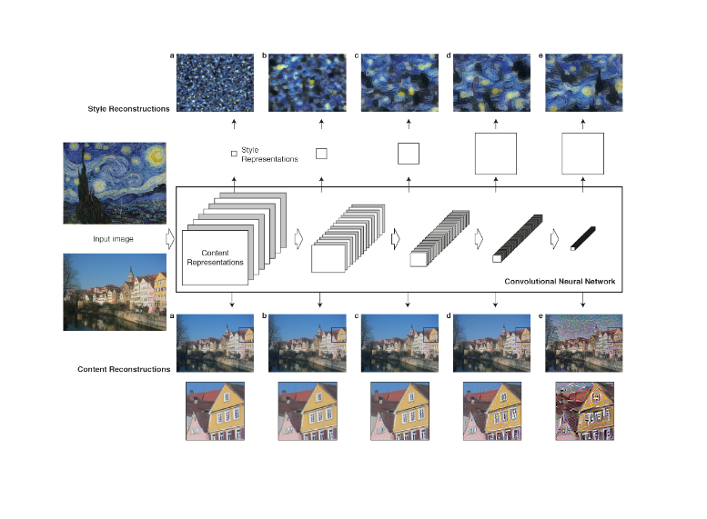
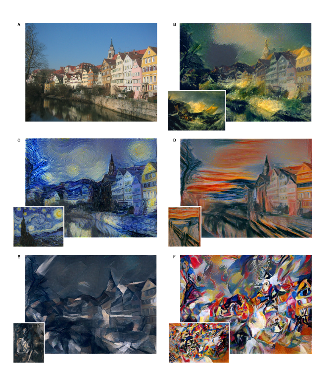
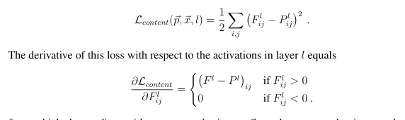
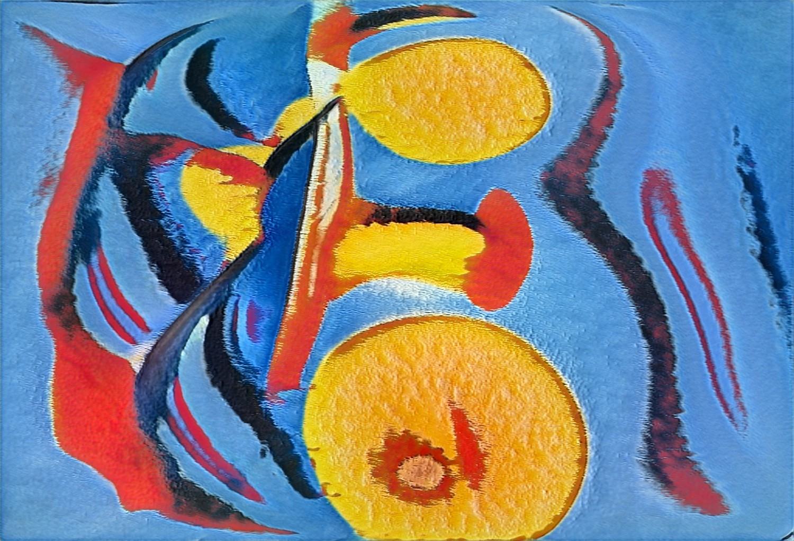
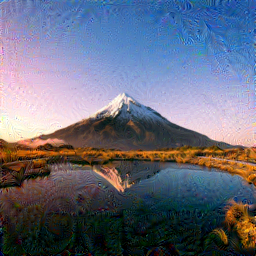

## Project Description - 

The neural style transfer is implemented as per paper that came in 2015 title "A Neural Algorithm of Artistic Style". The paper talks about combing the two images to create a new style image by using the style and feature transfer technique from both the images and tries to minimize the loss of the generated Gaussian image by using the custom loss function that can be tweaked by using the hyper-parameter alpha and beta. The implementation is done using pytorch. 

### Requirement 

- Python, Pytorch and Pillow
- Check requirements.txt

### Installation
```
git clone https://github.com/abhishekprakash256/Neural_style_transfer

cd Neural_style_transfer/

python3 main.py
```

### Methodology 

The process is started as a feature set is created using the features taken from the different convolution layer and in same manner the style is also extracted from the different CNN layers. The network used is the VGG-19, which has 16 CNN layers and 5 pool layers. The feature correlation is done by using the gram matrix. The loss is used to minimize the mean squared distance between the entries of the Gram matrix from the original image and the Gram matrix of the
image to be generated.  

- Feature extraction 





- Loss function 




### Results 

- Training Process 


- Content Image 


- Style Image 



- Generated Image 



### Note 

Run model for more epochs to achieve better results or tune hyper-paramaters

